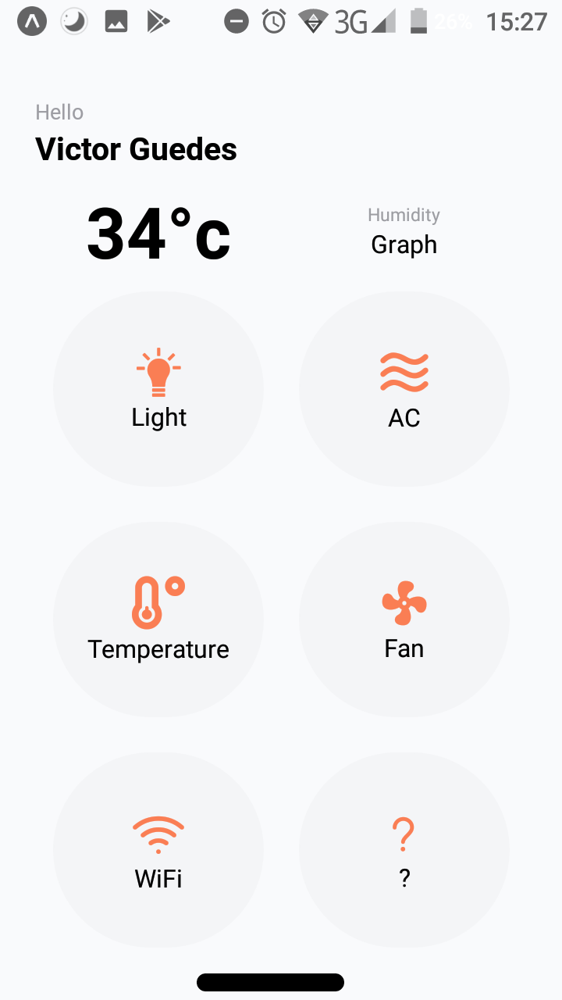

<h4 align="center">
    Smart Home Interface
</h4>

<p align="center>
    
</p>

<h1 align="center">
    
</h1>

This interface allow you to abstractly (because its just the UI)  control your house at your will.

## Installation

Use that code
```git clone https://github.com/craftsmaker/sh-interface.git```
Go in the frontend folder and use these commands
```
yarn install
yarn start
```
or
```
npm i
npm start
```

## License
[MIT](LICENSE)
